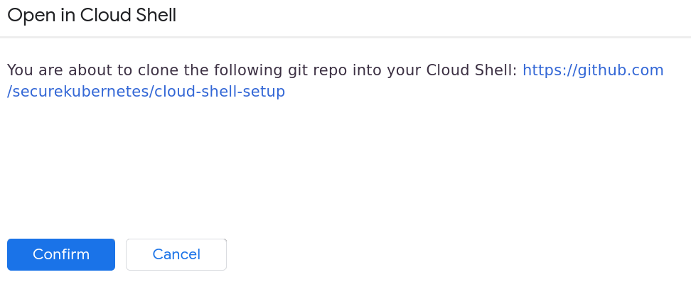
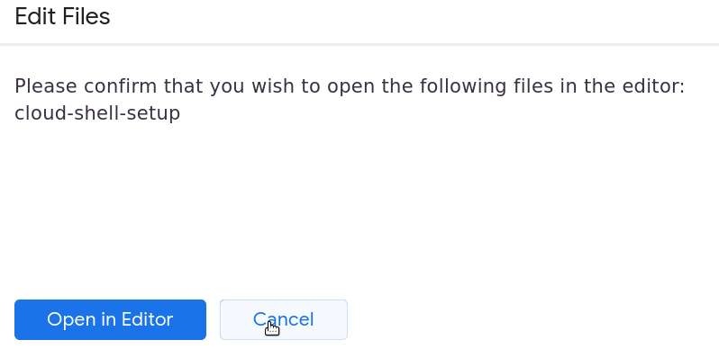

# Getting Started

1. Create a new Google account or choose an existing one, as you prefer.

1. Right-click the button below, choose "Open in New Tab", and sign in.<br>
[](https://console.cloud.google.com/kubernetes/list?cloudshell=true&cloudshell_git_repo=https://github.com/securekubernetes/cloud-shell-setup&shellonly=true)

1. Accept all Terms and Conditions as necessary.

1. Click "Confirm" if prompted to clone the git repo into your Cloud Shell. It may look like this:<br>


1. Click "Cancel" if prompted to open the code editor. It may look like this:<br>


1. If the Google account has not had Billing set up yet, click "Activate" on the free trial banner and step through the workflow to sign up for the free trial.

1. Once inside the Cloud Shell terminal, run setup.sh. This should create a new Project with a single-node Kubernetes cluster that contains the prerequisites for the workshop:
    ```console
    ./setup.sh
    ```
The script will prompt you for a project name (just hit enter to accept the default) and a password for your webshell instances.

1. When the script is finished, verify it worked correctly.

```console
kubectl get pods --all-namespaces
```

The output should look similar to this:
```
$ kubectl get pods --all-namespaces
NAMESPACE     NAME                                         READY   STATUS    RESTARTS   AGE
dev           app-6ffb94966d-9nqnk                         1/1     Running   0          70s
dev           dashboard-5889b89d4-dj7kq                    2/2     Running   0          70s
dev           db-649646fdfc-kzp6g                          1/1     Running   0          70s
...
prd           app-6ffb94966d-nfhn7                         1/1     Running   0          70s
prd           dashboard-7b5fbbc459-sm2zk                   2/2     Running   0          70s
prd           db-649646fdfc-vdwj6                          1/1     Running   0          70s

```

If it looks good, move on to Scenaro 1 Attack.
