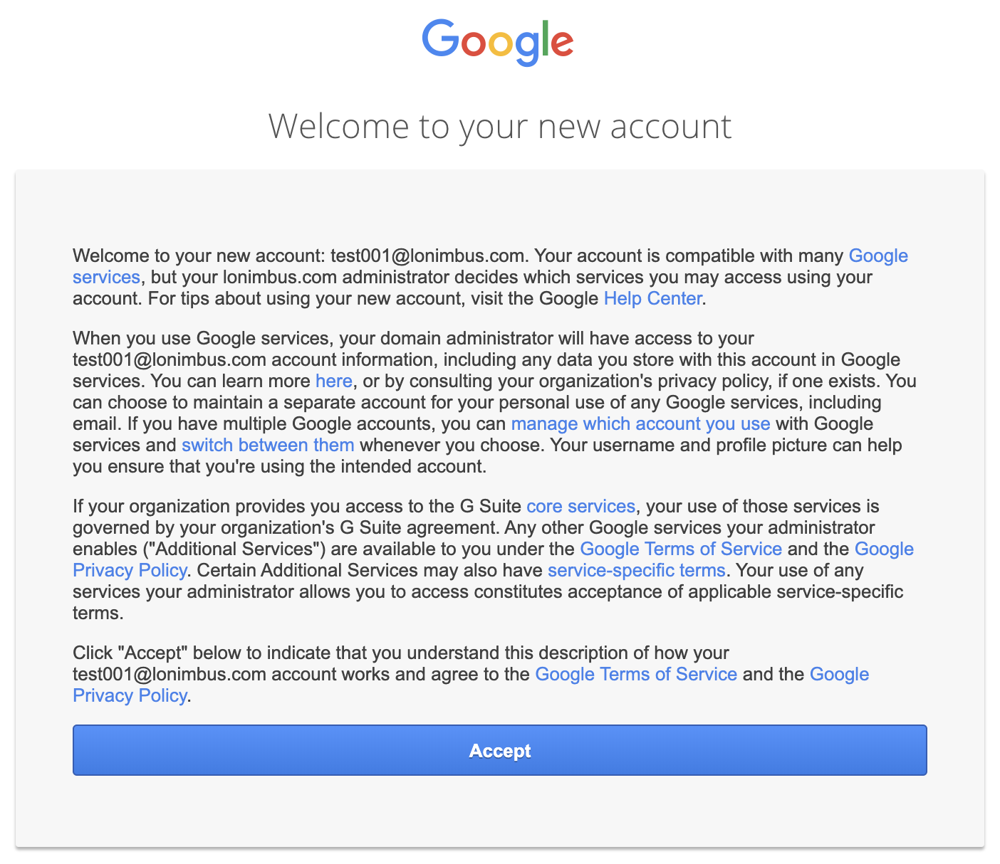
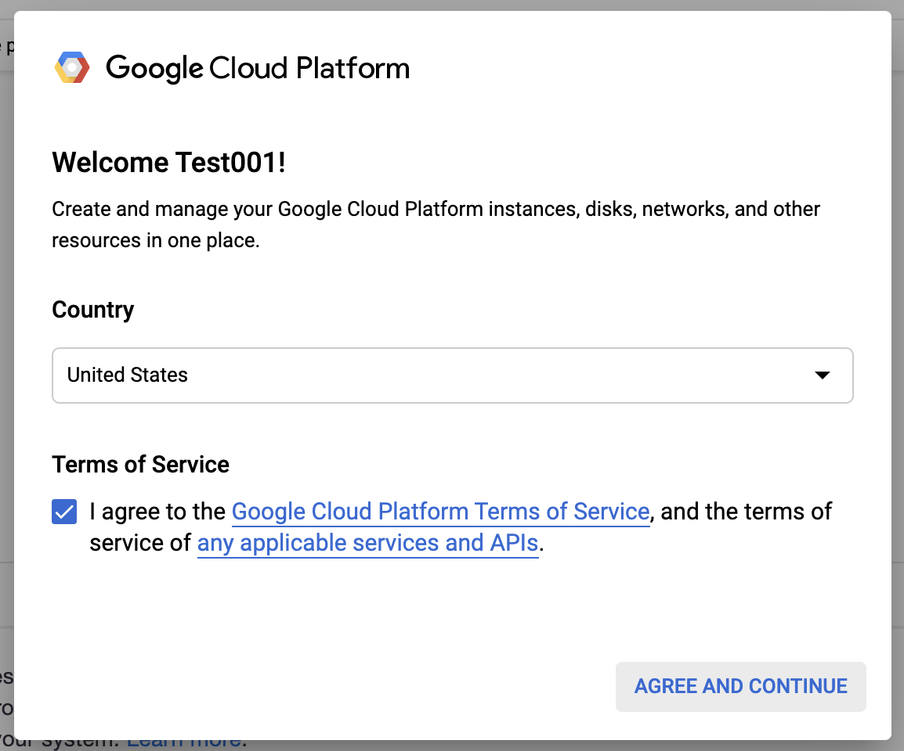

# KubeCon NA 2019 CTF

## Introduction

Welcome to the [KubeCon NA 2019](https://events19.linuxfoundation.org/events/kubecon-cloudnativecon-north-america-2019/) Tutorial: [Attacking and Defending Kubernetes Clusters: A Guided Tour](https://sched.co/Uaew) Walkthrough Guide.  Each participant will be given access to their own account with direct access to their own Kubernetes cluster environment.  Follow along as we take on the role of two attacking personas looking to make some money and one defending persona working hard to keep the cluster safe and healthy.

## Getting Connected

1. Get a "credential card" from one of the room assistants.  Do not share these credentials with others unless you are planning on working together.

    !!! warning "A Note on Sharing Credentials"
        For the best possible experience, every participant should interact with their own dedicated environment to avoid accidental contention when running commands that modify the environment.  We encourage working together with your neighbor--each working in their own cluster.
   

1. If necessary, <a href="https://securekubernetes.com">right-click this link and choose "Open Link in Icognito Window"</a> (or similar option).

1. Right-click the button below, choose "Open in New Tab", and sign in with your credentials.<br>
[](https://console.cloud.google.com/kubernetes/list?cloudshell=true&project=gke-ctf-dev1&cloudshell_git_repo=https://github.com/securekubernetes/cloud-shell-setup&shellonly=true)

1. Accept the Terms:

    

1. Accept the next set of Terms:

    

1. Check "I Agree..." and then __Start Cloud Shell__: 

    

1. At the top of the Browser window, click __Dismiss__ on the free GCP Trial banner if you see it.

1. Once inside the Cloud Shell terminal, run:
    ```console
    ./setup.sh
    ```

    !!! note "Use the Copy to Clipboard Feature"
        Each terminal command block in this guide has a double-square icon on the far right side which automatically copies the content to your paste buffer to make things easier to follow along.
    
1. Next, run:
    ```console
    kubectl get pods --all-namespaces
    ```
1. If you see a pod listing, you are all set. __Wait at this point until we work together as a group__.
1. If your neighbor needs assistance, please ask if they would like assistance and do so if they accept.  If you are having even greater difficulty, please raise your hand for room assistant help.

## About the Creators

* [@tabbysable](https://twitter.com/tabbysable) has been a hacker and cross-platform sysadmin since the turn of the century. She can often be found teaching network offense and defense to sysadmins, system administration to security folks, bicycling, and asking questions that start with "I wonder what happens if we..."
* [@petermbenjamin](https://twitter.com/petermbenjamin) is a Senior Software Engineer with a background in Information Security and a co-organizer for the San Diego Kubernetes and Go meet-ups. He has a passion for enabling engineers to build secure and scalable applications, services, and platforms on modern distributed systems.
* [@jimmesta](https://twitter.com/jimmesta) is a security leader that has been working in AppSec and Infrastructure Security for over 10 years. He founded and led the OWASP Santa Barbara chapter and co-organized the AppSec California security conference. Jimmy has taught at private corporate events and security conferences worldwide including AppSec USA, LocoMocoSec, SecAppDev, RSA, and B-Sides. He has spent significant time on both the offense and defense side of the industry and is constantly working towards building modern, developer-friendly security solutions.
* [@BradGeesaman](https://twitter.com/bradgeesaman) is an Independent Security Consultant helping clients improve the security of their Kubernetes clusters and supporting cloud environments. He has recently spoken at KubeCon NA 2017 on Kubernetes security and has over 5 years of experience building, designing, and delivering ethical hacking educational training scenarios.
