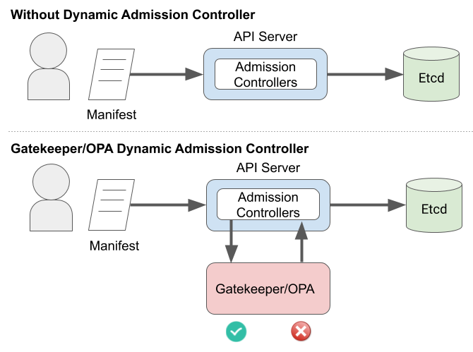

# Persistence: Scenario 2 Defense

## Backstory

### Name: __Blue__

* Still overworked
* Still can only do the bare minimum
* Uses the defaults when configuring systems
* Usually gets blamed for stability or security issues

### Motivations

* A week after the first incident, __Blue__ gets paged at 3am because “the website is slow again”.
* __Blue__, puzzled, takes another look.
* __Blue__ decides to dust off the résumé “just in case”.

## Defense

__Blue__ is paged again with the same message as last time. What is going on? Could this be the same problem again?

### Identifying the Issue

Let's run some basic checks again to see if we can find random workloads:

```console
kubectl get pods --all-namespaces
```

There does not appear to be any unusual workloads running on our cluster.

Just to be sure, let's check our cluster's resource consumption:

```console
kubectl top node
```

and

```console
kubectl top pod --all-namespaces
```

So far, everything looks normal. What gives?

Hold on. We installed `falco` last time and it is throwing us alerts in StackDriver.

In a new <a href="https://console.cloud.google.com/logs/viewer" target="_blank">StackDriver window</a>, let's run the query:

```console
resource.type="k8s_container"
resource.labels.container_name:"falco"
jsonPayload.rule="Launch Privileged Container" OR jsonPayload.rule="Terminal shell in container"
```

We're looking for `container` logs from `falco` where triggered rules are privileged containers or interactive shells.

Huh. This is odd. A privileged `alpine` container, but no other information to go off of? What can Kubernetes cluster logs tell us about this `alpine` container?

In a new <a href="https://console.cloud.google.com/logs/viewer" target="_blank">StackDriver window</a>, let's run this query:

```console
resource.type=k8s_cluster
protoPayload.request.spec.containers.image="alpine"
```

So, we see a few things:

1. A create event that was authorized with the `system:serviceaccount:dev:default` serviceaccount in the `dev` namespace.
1. A pod named `r00t` got created
1. The pod command is `nsenter --mount=/proc/1/ns/mnt -- /bin/bash`
1. The `securityContext` is `privileged: true`
1. The `hostPID` is set to `true`

This is not looking good. Can we see what this container did?

In a new <a href="https://console.cloud.google.com/logs/viewer" target="_blank">StackDriver window</a>, let's search for this `r00t` container logs:

```console
resource.type="k8s_container"
resource.labels.pod_name:r00t
```

Wow. We can see someone was running commands from this container.

But wait, they can run docker commands? How can they talk to the docker on the host from the container? OH NO! They must have broken out of the container and by this point they're on the host!

That `bitcoinero` container again must be what's causing slowness. But, they're trying to do something else.

They tried to create a pod, but failed. So, they created a Service and an Endpoint. They must be trying to open a backdoor of some sort to get back in later.

In cloud shell, let's check if those exist:

```console
kubectl -n kube-system get svc,ep
```

That's one sneaky hacker, for sure. But, jokes on them, We're not using service mesh.

Let's delete that service (the endpoint will be deleted too):

```console
kubectl -n kube-system delete svc/istio-mgmt
```

But, I want to know how did they get in in the first place?!?!?! The `create` event authorized because of the `dev:default` serviceaccount. So, what is in `dev` namespace that led to someone taking over the entire host?

```console
kubectl -n dev get pods
```

There is an `app`, a `db`, and a `dashboard`. Wait a second! Could it be an exposed dashboard?

```console
kubectl -n dev logs $(kubectl -n dev get pods -o name | grep dashboard) -c dashboard
```

```console
kubectl -n dev logs $(kubectl -n dev get pods -o name | grep dashboard) -c authproxy
```

It is an exposed dashboard. That's how they got in. There is `GET /webshell` in authproxy logs with the source IP.

We might want to revoke that serviceaccount token: 

```console
kubectl -n dev delete $(kubectl -n dev get secret -o name| grep default)
```

And perhaps disable the automatic mounting of serviceaccount tokens by setting `automountServiceAccountToken: false` in the pod spec, if the dashboard doesn't need it. 

But, how can we mitigate this further?

The attacker ran a privileged container, which they shouldn't have been able to. So, we should block that. I remember a talk at KubeCon this week about <a href="https://github.com/open-policy-agent/gatekeeper" target="_blank">Open-Policy-Agent/Gatekeeper</a> that gets deployed as an admission controller.

That should work because an admission controller is a piece of code that intercepts requests to the Kubernetes API server after the request is authenticated and authorized.



So, we should set two policies:

1. Deny privileged containers.
1. Allow only the images we expect to have in `dev` and `prd` namespaces.

First, let's apply Gatekeeper itself:

```console
kubectl apply -f https://raw.githubusercontent.com/securekubernetes/securekubernetes/master/manifests/security2.yaml
```

Second, let's apply the policies. If you receive an error about `no matches for kind... in version ...`, this means Gatekeeper has not kicked into gear yet. Wait a few seconds then re-apply policies:

```console
kubectl apply -f https://raw.githubusercontent.com/securekubernetes/securekubernetes/master/manifests/security2-policies.yaml
```

Let's see if this actually works by trying to run some containers that violate these policies.

First, let's try to run privileged container:

```console
kubectl apply -f - <<EOF
apiVersion: v1
kind: Pod
metadata:
  name: nginx
  labels:
    app: nginx
spec:
  containers:
  - name: nginx
    image: nginx
    ports:
    - containerPort: 80
    securityContext:
      privileged: true
EOF
```

We see that Kubernetes denied this request for 2 reasons (not whitelisted image and privileged), as expected.

Let's try running a non-whitelisted image:

```console
kubectl -n dev run alpine --image=alpine --restart=Never
```

We see that Kubernetes rejected this request again due to image not being whitelisted/allowed, as expected.

Can we still run pods that meet/satisfy the Gatekeeper policies? Let's find out:

```console
kubectl -n dev run ubuntu --image=ubuntu --restart=Never
```

Yes, looks like we can run pods that satisfy the policies and requirements we set on our cluster.

Even though we applied Falco and Gatekeeper, we should not continue to use this cluster since it has been compromised. We should create a new cluster and re-deploy our applications there once we've hardened and secured it enough.
